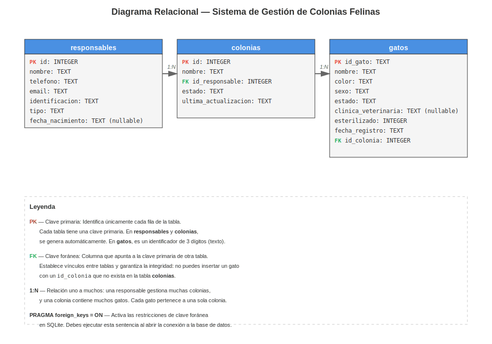

# Diseño de tablas SQLite para el Sistema de Gestión de Colonias Felinas

Este documento es una guía paso a paso para pasar tu proyecto de persistencia en memoria (diccionarios) a una base de datos SQLite. El objetivo es que al terminar tengas claro qué tablas necesitas, por qué están diseñadas así y cómo crearlas con SQL.

Como referencia, puedes consultar cómo se hizo esta misma transición en el proyecto de la expendedora: `modelo/cepy_pd4/proyecto/04-sqlite/expendedora/`.


## Fase 1: Identificar las entidades y sus atributos

El primer paso es hacer un inventario de las clases de tu dominio que almacenan datos. Cada una de estas clases se convertirá en una **tabla** de la base de datos.

Vamos a repasar tus clases y qué atributos de cada una necesitamos guardar:

**Gato** (`domain/gato.py`)

| Atributo | Tipo en Python | Tipo en SQL | Notas |
|---|---|---|---|
| `id_gato` | str | TEXT | ID de 3 dígitos |
| `nombre` | str | TEXT | Nombre del gato |
| `color` | str | TEXT | Color del pelaje |
| `sexo` | Enum | TEXT | MACHO, HEMBRA, DESCONOCIDO |
| `estado` | Enum | TEXT | COL, ACOG, ADOP, FALL, DESA |
| `clinica_veterinaria` | str | TEXT | Clínica donde se esterilizó (opcional) |
| `esterilizado` | bool | INTEGER | 0 (False) o 1 (True) |
| `fecha_registro` | date | TEXT | Formato "YYYY-MM-DD" |

**Colonia** (`domain/colonia.py`)

| Atributo | Tipo en Python | Tipo en SQL | Notas |
|---|---|---|---|
| `nombre` | str | TEXT | Nombre de la colonia |
| `responsable` | Responsable | INTEGER | FK a tabla responsables |
| `estado` | Enum | TEXT | SOLICITADA, ACTIVA, INACTIVA |
| `ultima_actualizacion` | date | TEXT | Formato "YYYY-MM-DD" |

Los atributos `_gatos` de la clase `Colonia` son colecciones (listas). Como una tabla solo puede tener valores simples en sus columnas, esas colecciones se guardarán en **tablas separadas**, como veremos más adelante.

**Responsable** (clases `PersonaFisica` y `Protectora` en `domain/responsable.py`)

Tienes 2 tipos de responsable, pero comparten atributos base:

| Atributo | Tipo en Python | Tipo en SQL | Notas |
|---|---|---|---|
| `id_responsable` | int | INTEGER | ID único |
| `nombre` | str | TEXT | Nombre completo |
| `telefono` | str | TEXT | 9 dígitos |
| `email` | str | TEXT | Válido |
| `identificacion` | str | TEXT | DNI o CIF |
| `tipo` | *(nuevo)* | TEXT | "fisica" o "protectora" |
| `fecha_nacimiento` | date | TEXT | Solo PersonaFisica, formato "YYYY-MM-DD" |
| `numero_registro` | str | TEXT | Solo Protectora |


## Fase 2: Conceptos básicos de bases de datos

Antes de avanzar, necesitas entender algunos conceptos que vamos a usar constantemente:

**Tabla, fila y columna**

Una tabla es el equivalente al diccionario o lista donde guardas tus datos en memoria, pero con la ventaja de que persiste en disco. Cada **fila** de la tabla es un objeto (un gato, una colonia...) y cada **columna** es un atributo de ese objeto.

**Clave primaria (PRIMARY KEY)**

Es la columna que identifica de forma única cada fila. En tu código ya tienes este concepto: `id_gato` para gatos. En SQLite puedes usar `INTEGER PRIMARY KEY AUTOINCREMENT` para generar automáticamente números únicos crecientes.

**Clave foránea (FOREIGN KEY)**

Es una columna en una tabla que "apunta" a la clave primaria de otra tabla. Sirve para crear vínculos entre tablas y para que la base de datos **garantice la integridad** de esos vínculos.

Por ejemplo: si la tabla `gatos` tiene una columna `id_colonia` que es clave foránea de `colonias`, la base de datos no te dejará insertar un gato con un `id_colonia` que no exista en la tabla `colonias`.

En SQLite, las claves foráneas se activan con `PRAGMA foreign_keys = ON` al inicio de cada conexión.


## Fase 3: Identificar las relaciones entre entidades

Cuando un objeto **"pertenece a"** o **"contiene"** otro, eso se traduce en la base de datos mediante **claves foráneas** (FK - Foreign Key).

### Relaciones uno a muchos (1:N)

- **Una colonia tiene muchos gatos**, pero cada gato pertenece a una sola colonia. En la tabla `gatos` añadirás una columna `id_colonia` (FK).

- **Un responsable puede ser responsable de muchas colonias**, pero cada colonia tiene un solo responsable. En la tabla `colonias` añadirás una columna `id_responsable` (FK).


## Fase 4: Diseño de las tablas

### Tabla `responsables`

Almacena tanto personas físicas como organizaciones protectoras. La columna `tipo` determina cuál es cada una.

| Columna | Tipo | Restricciones |
|---|---|---|
| `id` | INTEGER | PRIMARY KEY AUTOINCREMENT |
| `nombre` | TEXT | NOT NULL |
| `telefono` | TEXT | NOT NULL |
| `email` | TEXT | NOT NULL, UNIQUE |
| `identificacion` | TEXT | NOT NULL, UNIQUE |
| `tipo` | TEXT | NOT NULL (valores: 'fisica', 'protectora') |
| `fecha_nacimiento` | TEXT | NULL (solo para tipo='fisica') |
| `numero_registro` | TEXT | NULL (solo para tipo='protectora') |

### Tabla `colonias`

Corresponde a tu clase `Colonia`, sin las colecciones (gatos, que van en tabla separada).

| Columna | Tipo | Restricciones |
|---|---|---|
| `id` | INTEGER | PRIMARY KEY AUTOINCREMENT |
| `nombre` | TEXT | NOT NULL, UNIQUE |
| `id_responsable` | INTEGER | NOT NULL, FOREIGN KEY → responsables(id) |
| `estado` | TEXT | NOT NULL, DEFAULT 'SOLICITADA' |
| `ultima_actualizacion` | TEXT | NOT NULL |

### Tabla `gatos`

Aquí guardas todos los gatos de todas las colonias. Cada gato pertenece a una colonia.

| Columna | Tipo | Restricciones |
|---|---|---|
| `id_gato` | TEXT | PRIMARY KEY |
| `nombre` | TEXT | NOT NULL |
| `color` | TEXT | NOT NULL |
| `sexo` | TEXT | NOT NULL |
| `estado` | TEXT | NOT NULL |
| `clinica_veterinaria` | TEXT | NULL |
| `esterilizado` | INTEGER | NOT NULL, DEFAULT 0 |
| `fecha_registro` | TEXT | NOT NULL |
| `id_colonia` | INTEGER | NOT NULL, FOREIGN KEY → colonias(id) |

### Diagrama relacional




## Fase 5: Sentencias SQL para crear las tablas

Aquí tienes las sentencias SQL completas. El orden importa: las tablas que son referenciadas por otras (con FK) deben crearse primero.

```sql
PRAGMA foreign_keys = ON;

CREATE TABLE IF NOT EXISTS responsables (
    id INTEGER PRIMARY KEY AUTOINCREMENT,
    nombre TEXT NOT NULL,
    telefono TEXT NOT NULL,
    email TEXT NOT NULL UNIQUE,
    identificacion TEXT NOT NULL UNIQUE,
    tipo TEXT NOT NULL,
    fecha_nacimiento TEXT,
    numero_registro TEXT
);

CREATE TABLE IF NOT EXISTS colonias (
    id INTEGER PRIMARY KEY AUTOINCREMENT,
    nombre TEXT NOT NULL UNIQUE,
    id_responsable INTEGER NOT NULL,
    estado TEXT NOT NULL DEFAULT 'SOLICITADA',
    ultima_actualizacion TEXT NOT NULL,
    FOREIGN KEY (id_responsable) REFERENCES responsables(id)
);

CREATE TABLE IF NOT EXISTS gatos (
    id_gato TEXT PRIMARY KEY,
    nombre TEXT NOT NULL,
    color TEXT NOT NULL,
    sexo TEXT NOT NULL,
    estado TEXT NOT NULL,
    clinica_veterinaria TEXT,
    esterilizado INTEGER NOT NULL DEFAULT 0,
    fecha_registro TEXT NOT NULL,
    id_colonia INTEGER NOT NULL,
    FOREIGN KEY (id_colonia) REFERENCES colonias(id)
);
```


## Fase 6: Script de ejemplo para crear la base de datos

Este script crea la base de datos e inserta los datos iniciales que actualmente cargas en `infrastructure/datos_iniciales.py`.

```python
"""Script para crear la base de datos de colonias felinas con datos iniciales."""

import sqlite3
from pathlib import Path

# Eliminar la base de datos si ya existe (para recrearla limpia)
ruta_bd = Path("gesticat.db")
if ruta_bd.exists():
    ruta_bd.unlink()

conn = sqlite3.connect("gesticat.db")
cursor = conn.cursor()
cursor.execute("PRAGMA foreign_keys = ON")

# Crear tablas (copiar aquí las sentencias CREATE TABLE de la Fase 5)
# ...

# Insertar datos iniciales

# Responsables
cursor.execute("""
    INSERT INTO responsables (nombre, telefono, email, identificacion, tipo, fecha_nacimiento)
    VALUES ('Ana García López', '612345678', 'ana@email.com', '12345678A', 'fisica', '1985-06-15')
""")

cursor.execute("""
    INSERT INTO responsables (nombre, telefono, email, identificacion, tipo, numero_registro)
    VALUES ('Asociación Felina LPGC', '928123456', 'info@felina.com', 'A12345678', 'protectora', 'REG-001')
""")

# Colonias
cursor.execute("""
    INSERT INTO colonias (nombre, id_responsable, estado, ultima_actualizacion)
    VALUES ('Colonia Sur', 1, 'ACTIVA', '2026-04-15')
""")

# Gatos
cursor.execute("""
    INSERT INTO gatos (id_gato, nombre, color, sexo, estado, clinica_veterinaria, esterilizado, fecha_registro, id_colonia)
    VALUES ('001', 'Miguelito', 'Gris', 'MACHO', 'COL', 'Clínica Sur', 1, '2026-01-10', 1)
""")

cursor.execute("""
    INSERT INTO gatos (id_gato, nombre, color, sexo, estado, esterilizado, fecha_registro, id_colonia)
    VALUES ('002', 'Luna', 'Blanca', 'HEMBRA', 'COL', 0, '2026-02-14', 1)
""")

cursor.execute("""
    INSERT INTO gatos (id_gato, nombre, color, sexo, estado, esterilizado, fecha_registro, id_colonia)
    VALUES ('003', 'Sombra', 'Negro', 'DESCONOCIDO', 'ACOG', 0, '2026-03-05', 1)
""")

conn.commit()

# Mostrar contenido
print("Base de datos creada con datos iniciales.\n")

print("--- Responsables ---")
cursor.execute("SELECT * FROM responsables")
for fila in cursor.fetchall():
    print(f"  [{fila[0]}] {fila[1]} ({fila[5]})")

print("\n--- Colonias ---")
cursor.execute("SELECT * FROM colonias")
for fila in cursor.fetchall():
    print(f"  [{fila[0]}] {fila[1]} — Estado: {fila[3]}")

print("\n--- Gatos ---")
cursor.execute("SELECT * FROM gatos")
for fila in cursor.fetchall():
    print(f"  [{fila[0]}] {fila[1]} ({fila[3]}, {fila[4]})")

conn.close()
print("\nBase de datos guardada en gesticat.db")
```


## Resumen: de memoria a SQLite

| En memoria (ahora) | En SQLite (nuevo) |
|---|---|
| `_colonias_por_id = {}` | Tabla `colonias` |
| `_gatos_por_id = {}` | Tabla `gatos` + FK a colonias |
| Responsables (PersonaFisica/Protectora) | Tabla `responsables` con columna `tipo` |
