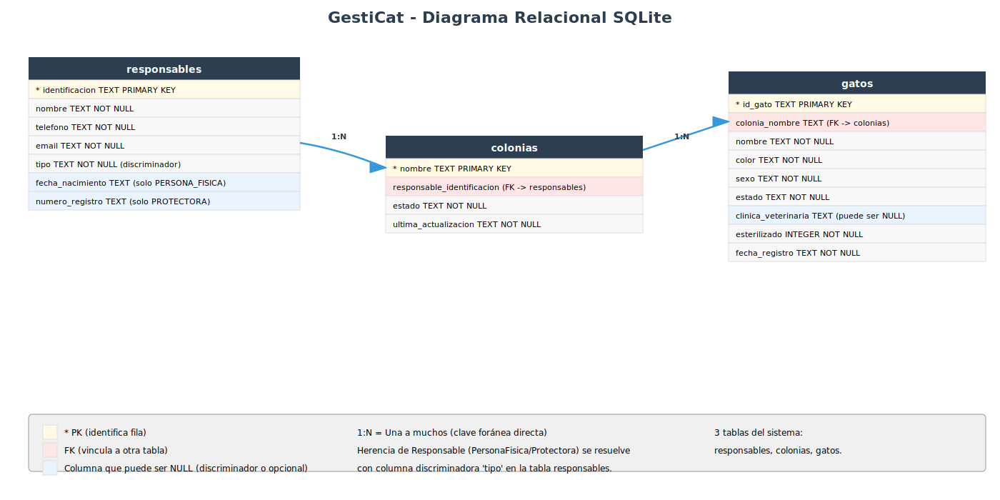

# Diseño de tablas SQLite para GestiCat LPGC

Este documento te guía paso a paso para transformar tu proyecto de almacenamiento en memoria (diccionarios de Python) a una **base de datos SQLite persistente**. El objetivo es que entiendas qué tablas necesitas crear, por qué están diseñadas así y cómo escribir el SQL.

Como referencia, puedes consultar cómo se hizo esta misma transición en el proyecto modelo de la expendedora (`modelo/cepy_pd4/proyecto/04-sqlite/expendedora/`).


## Fase 1: Identificar las entidades y sus atributos

El primer paso es hacer un inventario de las clases de tu dominio que almacenan datos. Cada una de estas clases se convertirá en una **tabla** de la base de datos.

Vamos a repasar tus clases y qué atributos de cada una necesitamos guardar:

**Gato** (`domain/gato.py`)

| Atributo | Tipo en Python | Tipo en SQL | Notas |
|---|---|---|---|
| `id_gato` | str | TEXT | Identificador único (3 dígitos, ej: "001") |
| `nombre` | str | TEXT | Nombre del gato |
| `color` | str | TEXT | Color del pelaje |
| `sexo` | Sexo (enum) | TEXT | H, M o ? |
| `estado` | EstadoGato (enum) | TEXT | COL, ACOG, ADOP, FALL, DESA |
| `clinica_veterinaria` | str \| None | TEXT | Nombre de la clínica (puede ser NULL) |
| `esterilizado` | bool | INTEGER | 1 o 0 |
| `fecha_registro` | date | TEXT | Fecha en formato ISO |

**Responsable** (`domain/responsable.py`) — Clase base abstracta

| Atributo | Tipo en Python | Tipo en SQL | Notas |
|---|---|---|---|
| `nombre` | str | TEXT | Nombre del responsable |
| `telefono` | str | TEXT | Teléfono (9 dígitos) |
| `email` | str | TEXT | Correo electrónico |
| `identificacion` | str | TEXT | DNI o CIF (MAYÚSCULAS) |
| (discriminador) | — | TEXT | Columna `tipo` para distinguir el subtipo: PERSONA_FISICA, PROTECTORA |
| `fecha_nacimiento` | date | TEXT | Solo para PersonaFisica (NULL en otras) |
| `numero_registro` | str | TEXT | Solo para Protectora (NULL en otras) |

**PersonaFisica** — Hereda de Responsable
- Añade `fecha_nacimiento` (mayor de edad)

**Protectora** — Hereda de Responsable
- Añade `numero_registro` (registro oficial)

**Colonia** (`domain/colonia.py`)

| Atributo | Tipo en Python | Tipo en SQL | Notas |
|---|---|---|---|
| `nombre` | str | TEXT | Nombre de la colonia (clave) |
| `responsable` | Responsable | TEXT (`responsable_identificacion`) | FK a `responsables(identificacion)` |
| `estado` | EstadoColonia (enum) | TEXT | SOLICITADA, ACTIVA, PENDIENTE, BAJA |
| `ultima_actualizacion` | date | TEXT | Fecha ISO de la última tramitación |
| `gatos` | list[Gato] | (1:N vía `gatos.colonia_nombre`) | Gatos de la colonia |


## Fase 2: Conceptos básicos de bases de datos

Antes de avanzar, necesitamos entender algunos conceptos:

### Tabla, fila y columna

Una **tabla** es como un diccionario de Python, pero guardado en disco:
- Cada **fila** es un objeto individual (un gato, una colonia, un responsable)
- Cada **columna** es un atributo de ese objeto (el nombre, el color, la fecha, etc.)

**Ejemplo:**
```
Tabla: gatos
┌──────────┬────────────┬────────┬──────┬────────┬──────────────┐
│ id_gato  │ nombre     │ color  │ sexo │ estado │ esterilizado │
├──────────┼────────────┼────────┼──────┼────────┼──────────────┤
│ 001      │ Miguelito  │ Gris   │ M    │ COL    │ 1            │
│ 002      │ Kiwi       │ Blanca │ H    │ ACOG   │ 1            │
│ 004      │ Sombra     │ Negro  │ H    │ COL    │ 0            │
└──────────┴────────────┴────────┴──────┴────────┴──────────────┘
```

### Clave primaria (PRIMARY KEY)

Es la columna que **identifica de forma única cada fila**. No puede haber dos filas con el mismo valor en la clave primaria. En tu código:
- Para gatos → `id_gato` es la clave primaria
- Para responsables → `identificacion` (DNI o CIF) es la clave primaria
- Para colonias → `nombre` es la clave primaria

### Clave foránea (FOREIGN KEY)

Es una columna que "apunta" a la clave primaria de **otra tabla**. Sirve para crear vínculos entre tablas y permite que la base de datos garantice que esos vínculos siempre sean válidos.

**Ejemplo:** Una colonia tiene un `responsable_identificacion` que apunta a la clave primaria `identificacion` de la tabla `responsables`. Si intentas guardar una colonia con un responsable que no existe, la base de datos lo rechazará automáticamente.

En SQLite, para que se apliquen restricciones al usar las claves foráneas lo hacemos con `PRAGMA foreign_keys = ON` al inicio de cada conexión.

### Relaciones entre tablas

Una **relación** describe cómo se vinculan las filas de una tabla A con las filas de otra tabla B. Los tipos más comunes son:

- **Uno a uno (1:1):** Una fila de la tabla A se vincula con exactamente una fila de la tabla B. Raro en bases de datos.
  - Ejemplo: un empleado tiene un único correo corporativo.

- **Uno a muchos (1:N):** Una fila de la tabla A se vincula con múltiples filas de la tabla B. Muy común.
  - Ejemplo en tu proyecto: una **colonia** contiene muchos **gatos**. La colonia "Colonia Sur" puede tener los gatos 001, 002, 004 y 005.
  - Otro ejemplo: un **responsable** puede estar a cargo de muchas **colonias**.

- **Muchos a muchos (N:M):** Una fila de la tabla A se vincula con múltiples filas de la tabla B, y viceversa. Requiere una tabla intermedia.
  - Ejemplo general: un **alumno** puede estar matriculado en muchos **cursos**.
  - En tu proyecto **NO hay relaciones N:M directas** (cada gato pertenece a una única colonia en un momento dado).


## Fase 3: Identificar las relaciones entre entidades

Cuando un objeto **"pertenece a"** o **"contiene"** otro, eso se traduce en la base de datos mediante **claves foráneas** (FK).

### Relaciones uno a muchos (1:N)

**Una colonia contiene muchos gatos**
- Cada gato pertenece a una única colonia en un momento dado
- Usamos la columna `colonia_nombre` en la tabla `gatos` como clave foránea que apunta a `colonias(nombre)`

**Un responsable puede estar a cargo de muchas colonias**
- Cada colonia tiene un único responsable
- Usamos la columna `responsable_identificacion` en la tabla `colonias` como clave foránea que apunta a `responsables(identificacion)`

### Herencia en el dominio

En tu código, `PersonaFisica` y `Protectora` heredan de `Responsable`. En SQL, usamos:

**Tabla única con discriminador** (la opción elegida)
- Una sola tabla `responsables` con columna `tipo` ('PERSONA_FISICA', 'PROTECTORA')
- Los atributos específicos (`fecha_nacimiento`, `numero_registro`) se incluyen como columnas que aceptan NULL
- Más simple que dividir en varias tablas
- Evita uniones (joins) complicadas al recuperar un responsable


## Fase 4: Diseño de las tablas

### Tabla `responsables` — Responsables de las colonias

Almacena tanto personas físicas como protectoras. Una única tabla con columna discriminadora.

| Columna | Tipo | Notas |
|---|---|---|
| `identificacion` | TEXT | Clave primaria (DNI o CIF en MAYÚSCULAS) |
| `nombre` | TEXT | Nombre (NOT NULL) |
| `telefono` | TEXT | 9 dígitos (NOT NULL) |
| `email` | TEXT | Email válido (NOT NULL) |
| `tipo` | TEXT | Discriminador: 'PERSONA_FISICA' o 'PROTECTORA' (NOT NULL) |
| `fecha_nacimiento` | TEXT | Solo para PersonaFisica (NULL en otras) |
| `numero_registro` | TEXT | Solo para Protectora (NULL en otras) |

**¿Por qué `tipo` es necesario?** Aunque `PersonaFisica` y `Protectora` heredan de `Responsable`, en SQL usamos una sola tabla. La columna `tipo` indica el subtipo, para poder reconstruir el objeto correcto cuando lo recuperes.


### Tabla `colonias` — Las colonias felinas

Almacena las colonias registradas en el sistema.

| Columna | Tipo | Notas |
|---|---|---|
| `nombre` | TEXT | Clave primaria (ej: "Colonia Sur") |
| `responsable_identificacion` | TEXT | Clave foránea → `responsables(identificacion)` (NOT NULL) |
| `estado` | TEXT | SOLICITADA, ACTIVA, PENDIENTE, BAJA (NOT NULL) |
| `ultima_actualizacion` | TEXT | Fecha ISO (NOT NULL) |


### Tabla `gatos` — Los gatos censados

Almacena cada gato con sus datos.

| Columna | Tipo | Notas |
|---|---|---|
| `id_gato` | TEXT | Clave primaria (3 dígitos) |
| `colonia_nombre` | TEXT | Clave foránea → `colonias(nombre)` (NOT NULL) |
| `nombre` | TEXT | Nombre del gato (NOT NULL) |
| `color` | TEXT | Color del pelaje (NOT NULL) |
| `sexo` | TEXT | H, M, ? (NOT NULL) |
| `estado` | TEXT | COL, ACOG, ADOP, FALL, DESA (NOT NULL) |
| `clinica_veterinaria` | TEXT | Nombre de la clínica (NULL si no tiene) |
| `esterilizado` | INTEGER | 1 o 0 (NOT NULL) |
| `fecha_registro` | TEXT | Fecha ISO de registro (NOT NULL) |

**¿Por qué los enums Sexo y EstadoGato se guardan como TEXT?** Porque SQLite no tiene tipo ENUM. Guardamos el valor del enum (ej: "M", "COL") como cadena y lo convertimos de vuelta a enum al recuperar.

### Diagrama relacional resultante

Con el diseño de tablas descrito arriba, el esquema de la base de datos queda así:



El diagrama muestra las 3 tablas del sistema y sus relaciones:
- **responsables → colonias** (1:N): un responsable puede tener muchas colonias
- **colonias → gatos** (1:N): una colonia contiene muchos gatos


## Fase 5: SQL de creación

Aquí tienes el SQL completo para crear todas las tablas. **El orden importa:** las tablas que son referenciadas por otras (con claves foráneas) deben crearse primero.

```sql
PRAGMA foreign_keys = ON;

-- 1. Tabla de responsables (no depende de otras)
CREATE TABLE IF NOT EXISTS responsables (
    identificacion TEXT PRIMARY KEY,
    nombre TEXT NOT NULL,
    telefono TEXT NOT NULL,
    email TEXT NOT NULL,
    tipo TEXT NOT NULL,
    fecha_nacimiento TEXT,
    numero_registro TEXT
);

-- 2. Tabla de colonias (depende de responsables)
CREATE TABLE IF NOT EXISTS colonias (
    nombre TEXT PRIMARY KEY,
    responsable_identificacion TEXT NOT NULL,
    estado TEXT NOT NULL,
    ultima_actualizacion TEXT NOT NULL,
    FOREIGN KEY (responsable_identificacion) REFERENCES responsables(identificacion)
);

-- 3. Tabla de gatos (depende de colonias)
CREATE TABLE IF NOT EXISTS gatos (
    id_gato TEXT PRIMARY KEY,
    colonia_nombre TEXT NOT NULL,
    nombre TEXT NOT NULL,
    color TEXT NOT NULL,
    sexo TEXT NOT NULL,
    estado TEXT NOT NULL,
    clinica_veterinaria TEXT,
    esterilizado INTEGER NOT NULL,
    fecha_registro TEXT NOT NULL,
    FOREIGN KEY (colonia_nombre) REFERENCES colonias(nombre)
);
```

**Explicación del orden:**
1. **responsables** se crea primero porque no tiene claves foráneas
2. **colonias** depende de `responsables`
3. **gatos** depende de `colonias`


## Fase 6: Script de ejemplo para crear la base de datos

Este script crea la base de datos con todas las tablas e inserta datos iniciales (los mismos que tu `datos_iniciales.py`):

```python
"""Script para crear la base de datos de GestiCat con datos iniciales."""

import sqlite3
from pathlib import Path

# Eliminar la base de datos si ya existe (para recrearla limpia)
ruta_bd = Path("gesticat.db")
if ruta_bd.exists():
    ruta_bd.unlink()

conn = sqlite3.connect(ruta_bd)
cursor = conn.cursor()
cursor.execute("PRAGMA foreign_keys = ON")

# Crear tablas (en el orden correcto)
cursor.executescript("""
PRAGMA foreign_keys = ON;

CREATE TABLE IF NOT EXISTS responsables (
    identificacion TEXT PRIMARY KEY,
    nombre TEXT NOT NULL,
    telefono TEXT NOT NULL,
    email TEXT NOT NULL,
    tipo TEXT NOT NULL,
    fecha_nacimiento TEXT,
    numero_registro TEXT
);

CREATE TABLE IF NOT EXISTS colonias (
    nombre TEXT PRIMARY KEY,
    responsable_identificacion TEXT NOT NULL,
    estado TEXT NOT NULL,
    ultima_actualizacion TEXT NOT NULL,
    FOREIGN KEY (responsable_identificacion) REFERENCES responsables(identificacion)
);

CREATE TABLE IF NOT EXISTS gatos (
    id_gato TEXT PRIMARY KEY,
    colonia_nombre TEXT NOT NULL,
    nombre TEXT NOT NULL,
    color TEXT NOT NULL,
    sexo TEXT NOT NULL,
    estado TEXT NOT NULL,
    clinica_veterinaria TEXT,
    esterilizado INTEGER NOT NULL,
    fecha_registro TEXT NOT NULL,
    FOREIGN KEY (colonia_nombre) REFERENCES colonias(nombre)
);
""")

# Datos iniciales (coinciden con tu datos_iniciales.py)

# 1. Responsable
cursor.execute("""
    INSERT INTO responsables
    (identificacion, nombre, telefono, email, tipo, fecha_nacimiento, numero_registro)
    VALUES ('12345678A', 'Siboney Apellido', '612345678',
            'siboney_apellido@email.com', 'PERSONA_FISICA', '1986-10-10', NULL)
""")

# 2. Colonia
cursor.execute("""
    INSERT INTO colonias
    (nombre, responsable_identificacion, estado, ultima_actualizacion)
    VALUES ('Colonia Sur', '12345678A', 'SOLICITADA', date('now'))
""")

# 3. Gatos
gatos_iniciales = [
    ("001", "Miguelito",  "Gris",   "M", "COL",  "Clínica Sur",   1, "2024-01-10"),
    ("002", "Kiwi",       "Blanca", "H", "ACOG", "Clínica Sur",   1, "2024-02-15"),
    ("003", "GordiLuis",  "Pardo",  "M", "FALL", "Clínica Norte", 1, "2024-03-20"),
    ("004", "Sombra",     "Negro",  "H", "COL",  None,            0, "2024-04-05"),
    ("005", "Nieve",      "Blanco", "?", "COL",  None,            0, "2024-06-01"),
]

cursor.executemany(
    """INSERT INTO gatos
       (id_gato, colonia_nombre, nombre, color, sexo, estado,
        clinica_veterinaria, esterilizado, fecha_registro)
       VALUES (?, 'Colonia Sur', ?, ?, ?, ?, ?, ?, ?)""",
    gatos_iniciales,
)

conn.commit()
conn.close()

print("Base de datos creada en: gesticat.db")
```

**Características importantes:**
- Elimina la BD existente para recrearla limpia (idempotente)
- Crea las tablas en el orden correcto respetando claves foráneas
- Activa integridad referencial con `PRAGMA foreign_keys = ON`
- Inserta 1 responsable, 1 colonia y 5 gatos (los mismos que `datos_iniciales.py`)


## Fase 7: Ejemplo de implementación del repositorio SQLite

Tu interfaz `RepositorioGatos` (en `domain/repositorio_gatos.py`) define los métodos que cualquier implementación de repositorio debe cumplir: `insertar`, `actualizar`, `obtener`, `listar`, `quitar`. Actualmente tienes una implementación **en memoria** (`infrastructure/repositorio_gatos_memoria.py`). Para la Fase 04 necesitas una segunda implementación que use SQLite en lugar de un diccionario.

**Importante:** Este ejemplo asume que has creado las **excepciones de dominio** en `infrastructure/errores.py`. Si aún no las has creado, debes hacerlo primero. Las excepciones recomendadas son:

```python
class ErrorRepositorio(Exception):
    """Clase base para todas las excepciones del repositorio."""
    pass

class GatoYaExisteError(ErrorRepositorio):
    """Se lanza cuando se intenta insertar un gato con id duplicado."""
    pass

class GatoNoEncontradoError(ErrorRepositorio):
    """Se lanza cuando se intenta recuperar un gato inexistente."""
    pass

class ErrorPersistencia(ErrorRepositorio):
    """Se lanza para errores inesperados de la base de datos."""
    pass
```

**Ejemplo para `RepositorioGatosSQLite` — Método `insertar()`:**

```python
import sqlite3
from datetime import date
from gesticat.domain.gato import Gato, Sexo, EstadoGato
from gesticat.domain.repositorio_gatos import RepositorioGatos
from gesticat.infrastructure.errores import (
    GatoYaExisteError,
    ErrorPersistencia,
)


class RepositorioGatosSQLite(RepositorioGatos):
    def __init__(self, ruta_bd="gesticat.db", colonia_nombre="Colonia Sur"):
        self._ruta_bd = ruta_bd
        self._colonia_nombre = colonia_nombre

    def _conectar(self):
        """Crea una conexión con integridad referencial activada."""
        conn = sqlite3.connect(self._ruta_bd)
        conn.execute("PRAGMA foreign_keys = ON")
        return conn

    def insertar(self, gato):
        """Inserta un nuevo gato en la base de datos."""
        conn = self._conectar()
        try:
            with conn:
                cursor = conn.cursor()
                cursor.execute(
                    """INSERT INTO gatos
                       (id_gato, colonia_nombre, nombre, color, sexo, estado,
                        clinica_veterinaria, esterilizado, fecha_registro)
                       VALUES (?, ?, ?, ?, ?, ?, ?, ?, ?)""",
                    (
                        gato.id_gato,
                        self._colonia_nombre,
                        gato.nombre,
                        gato.color,
                        gato.sexo.value,   # enum -> str
                        gato.estado.name,  # enum -> str
                        gato.clinica_veterinaria,
                        1 if gato.esterilizado else 0,
                        gato.fecha_registro.isoformat(),
                    ),
                )
        except sqlite3.IntegrityError as e:
            raise GatoYaExisteError(
                f"Ya existe un gato con id '{gato.id_gato}'"
            ) from e
        except sqlite3.OperationalError as e:
            raise ErrorPersistencia(f"Error al insertar el gato: {e}") from e
        finally:
            conn.close()
```

**Explicación:**
1. `_conectar()` crea una conexión y activa `PRAGMA foreign_keys = ON`.
2. La consulta `INSERT` usa parámetros `?` para prevenir inyección SQL.
3. Los enums (`Sexo`, `EstadoGato`) se convierten a cadena antes de guardar: `.value` para el valor ("M", "H", "?") y `.name` para el nombre del miembro ("COL", "ACOG", etc.).
4. El booleano `esterilizado` se convierte a 1/0.
5. La fecha se guarda como ISO 8601 (`date.isoformat()` → "2024-01-10").
6. `IntegrityError` por `id_gato` duplicado → `GatoYaExisteError`.

**Ejemplo para `RepositorioGatosSQLite` — Método `obtener()`:**

```python
    def obtener(self, id_gato):
        """Recupera un gato por su id. Devuelve None si no existe."""
        conn = self._conectar()
        try:
            cursor = conn.cursor()
            cursor.execute(
                """SELECT id_gato, nombre, color, sexo, estado,
                          clinica_veterinaria, esterilizado, fecha_registro
                   FROM gatos WHERE id_gato = ?""",
                (id_gato,),
            )
            fila = cursor.fetchone()
            if fila is None:
                return None  # Respeta el contrato actual del repo en memoria
            return self._fila_a_gato(fila)
        except sqlite3.OperationalError as e:
            raise ErrorPersistencia(f"Error al obtener el gato: {e}") from e
        finally:
            conn.close()

    def _fila_a_gato(self, fila):
        """Convierte una fila de la BD en un objeto Gato."""
        (id_gato, nombre, color, sexo_str, estado_str,
         clinica, esterilizado, fecha_str) = fila
        return Gato(
            id_gato=id_gato,
            nombre=nombre,
            color=color,
            sexo=Sexo(sexo_str),            # "M" -> Sexo.MACHO
            estado=EstadoGato[estado_str],  # "COL" -> EstadoGato.COL
            clinica_veterinaria=clinica,
            esterilizado=bool(esterilizado),
            fecha_registro=date.fromisoformat(fecha_str),
        )
```

**Puntos clave de ambos métodos:**
- Siempre activa `PRAGMA foreign_keys = ON` a través de `_conectar()`.
- Usa parámetros `?` para prevenir inyección SQL.
- Transforma `sqlite3.IntegrityError` y `sqlite3.OperationalError` en excepciones de dominio.
- `obtener()` devuelve `None` cuando el gato no existe, respetando el contrato del repositorio en memoria.
- Los enums se convierten correctamente: al guardar usas `.value` o `.name`; al recuperar, `Sexo(valor)` o `EstadoGato[nombre]`.


## Resumen: de memoria a SQLite

### Mapeado de conceptos

| Código Python (fase actual, en memoria) | Base de datos SQLite (fase 04) | Propósito |
|---|---|---|
| `RepositorioGatosMemoria._gatos = {}` | Tabla `gatos` | Guardar todos los gatos persistentemente |
| Responsable pasado por constructor | Tabla `responsables` (con discriminador `tipo`) | Guardar responsables persistentemente |
| Colonia instanciada en `datos_iniciales.py` | Tabla `colonias` | Guardar las colonias persistentemente |

### Beneficios de migrar a SQLite

- **Persistencia:** Los datos no desaparecen al cerrar el programa
- **Integridad referencial:** Las claves foráneas garantizan que no habrá datos rotos (ej: un gato asignado a una colonia que no existe)
- **Escalabilidad:** Manejo eficiente de grandes volúmenes de datos
- **Estándar:** SQL es un estándar conocido y usado en la industria
- **Simple:** SQLite no necesita un servidor externo, es un fichero `gesticat.db`

### Arquitectura en capas (sin cambios en lógica)

```
┌─────────────────────────────────────┐
│  Presentation (menú)                │
│  - No toca datos                    │
└──────────────┬──────────────────────┘
               │ usa
┌──────────────▼──────────────────────┐
│  Application (servicios)            │
│  - ServicioColonia                  │
│  - Usa el repositorio               │
└──────────────┬──────────────────────┘
               │ usa
┌──────────────▼──────────────────────┐
│  Domain (entidades + contratos)     │
│  - Gato, Colonia, Responsable       │
│  - RepositorioGatos (contrato)      │
└──────────────┬──────────────────────┘
               │ implementado por
┌──────────────▼──────────────────────┐
│  Infrastructure (implementación)    │
│  - RepositorioGatosSQLite           │
│  - Lee/escribe en tablas            │
└─────────────────────────────────────┘
```

**Lo importante:** Domain y Application no cambian. Solo Infrastructure.


## Estado de la Checklist Fase 04

Marcamos con [x] los apartados que **este documento cubre** y con [ ] los que son **responsabilidad tuya** dentro de tu proyecto. Para los apartados pendientes puedes consultar cómo se hicieron en el proyecto modelo de la expendedora (`modelo/cepy_pd4/proyecto/04-sqlite/expendedora/`).

### Diseño e implementación del esquema de base de datos

- [x] Copiar en `04-sqlite` el estado base de `03-testing` (o crear rama específica para la fase 04) — *Responsabilidad tuya (aún no creada)*
- [x] Diseñar las tablas SQL mapeando cada entidad de dominio a tablas con sus columnas, tipos y restricciones — **Fases 1-4 de este documento**
- [x] Usar nombres de columnas en snake_case — **Fase 4 de este documento**

### Script de inicialización de base de datos

- [x] Crear script que cree el esquema de la BD e inserte datos iniciales de prueba — **Fase 6 de este documento**
  - [x] Debe poder ejecutarse varias veces sin error — **Fase 6**
  - [x] Crea todas las tablas respetando dependencias de claves foráneas — **Fases 5-6**
  - [x] Inserta datos iniciales para probar la aplicación — **Fase 6**

### Excepciones de dominio para persistencia

- [x] (*opcional*) Crear fichero de excepciones (`infrastructure/errores.py`) — **Fase 7 de este documento (código de ejemplo)**
  - [x] Clase base para todas las excepciones de persistencia — **Fase 7**
  - [x] Excepciones por cada tipo de error (duplicado, no encontrado, etc.) — **Fase 7**

### Implementación del repositorio SQLite

- [x] Crear clase(s) de repositorio que implementen persistencia en SQLite — **Fase 7 de este documento (código de ejemplo)**
- [x] Usar consultas SQL parametrizadas (parámetros `?`) para prevenir inyección SQL — **Fase 7**
- [x] Capturar excepciones SQLite y transformarlas en excepciones de dominio — **Fase 7**
- [x] Activar `PRAGMA foreign_keys = ON` al conectar — **Fase 7**
- [x] **El flujo principal (menú) debe usar SOLO el repositorio SQLite** — *Responsabilidad tuya*

### Repositorio en memoria (referencia, no en uso)

- [ ] (**opcional**) Mantener el código del repositorio en memoria como referencia — *Responsabilidad tuya*
- [ ] (**opcional**) Modificar el repositorio en memoria para lanzar las mismas excepciones de dominio — *Responsabilidad tuya*

### Integración con SQLite en la capa de presentación

- [ ] Modificar la presentación para cargar datos desde la BD — *Responsabilidad tuya*
- [ ] Capturar excepciones de dominio, no de `sqlite3` — *Responsabilidad tuya*
- [ ] (*opcional*) Mostrar mensajes amigables al usuario — *Responsabilidad tuya*
- [ ] No hacer imports de `sqlite3` directamente en la presentación — *Responsabilidad tuya*

### Actualización de los tests

- [ ] *(opcional)* Actualizar tests existentes para esperar excepciones de dominio — *Responsabilidad tuya*
- [ ] Verificar que `python -m unittest` pasa con todos los tests en verde — *Responsabilidad tuya*
- [ ] *(opcional)* Crear tests específicos para el repositorio SQLite — *Responsabilidad tuya*

### Documentación

- [ ] Actualizar `CHANGELOG.md` (versión `0.4.0`) con los cambios principales — *Responsabilidad tuya*
- [ ] Actualizar `README.md` con instrucciones de `crear_bd.py` — *Responsabilidad tuya*
- [ ] Documentar el diseño de la BD en `docs/DISEÑO_BD.md` — *Este documento es base para completarlo*
- [ ] (*opcional*) Documentar el contrato de excepciones en `docs/CONTRATO_EXCEPCIONES.md` — *Responsabilidad tuya*

### Verificación final

- [ ] La aplicación funciona igual desde el punto de vista del usuario — *Responsabilidad tuya*
- [ ] Los datos persisten entre ejecuciones — *Responsabilidad tuya*
- [ ] Los tests pasan todos sin cambios de lógica de dominio — *Responsabilidad tuya*


## Próximos pasos

1. Lee este documento con atención, especialmente las Fases 2-4.
2. Crea la subcarpeta `04-sqlite/` copiando el estado base de `03-testing/`.
3. Crea la base de datos ejecutando el script de la Fase 6 (`crear_bd.py`).
4. Crea `infrastructure/errores.py` siguiendo el ejemplo de la Fase 7.
5. Implementa `RepositorioGatosSQLite` (y opcionalmente `RepositorioResponsablesSQLite` y `RepositorioColoniasSQLite`).
6. Modifica `datos_iniciales.py` para usar los repositorios SQLite en lugar de `RepositorioGatosMemoria`.
7. Actualiza la presentación para capturar excepciones de dominio.
8. Actualiza tests y documentación (`CHANGELOG.md`, `README.md`, `docs/DISEÑO_BD.md`).
